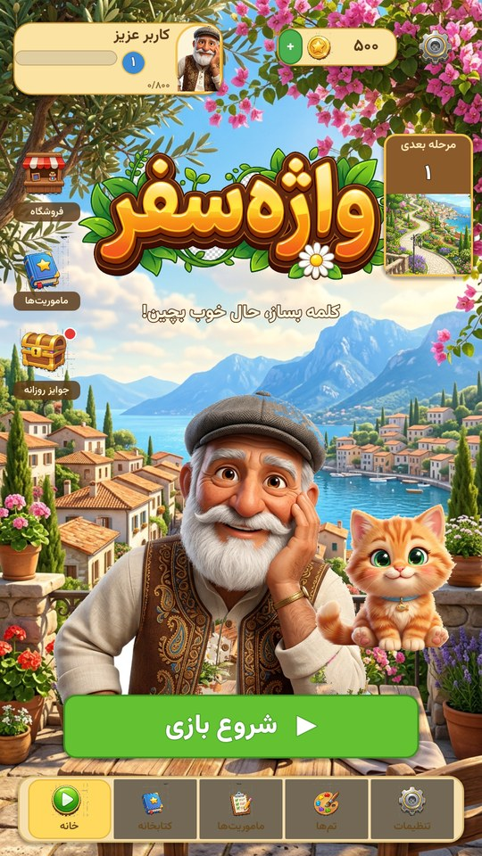
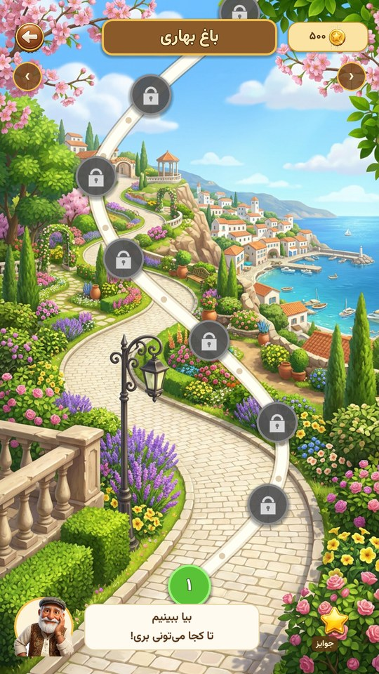
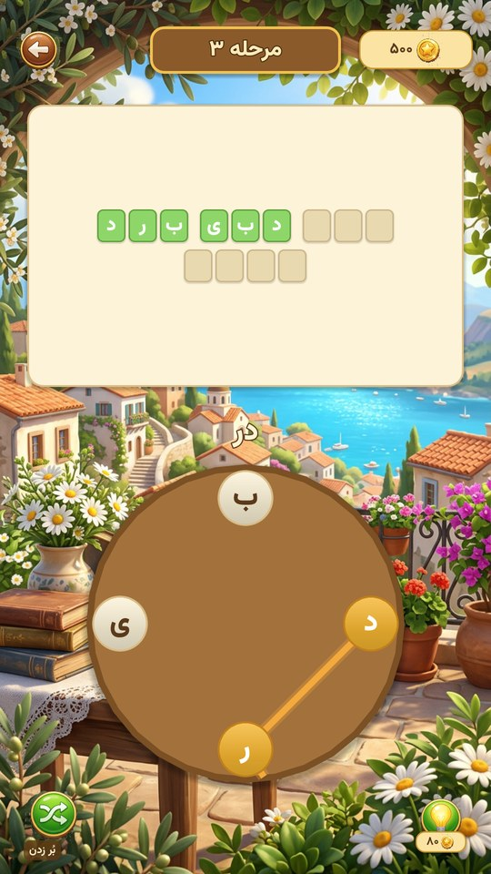
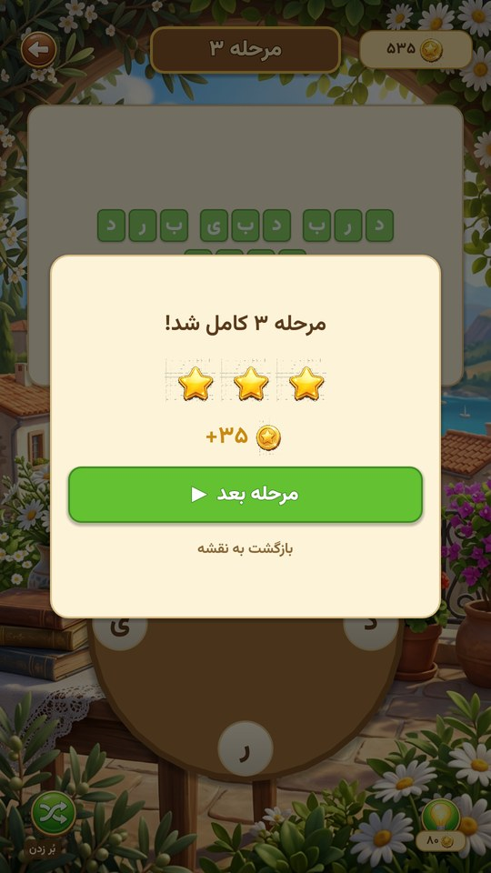

# واژه‌سفر (Vazhe Safar) — بازی واژه‌سازی فارسی برای اندروید

[](https://github.com/nikionecr-spec/VazheSafar/actions/workflows/build-apk.yml)
[](https://godotengine.org)
[](#)
[](LICENSE)

بازی کامل و قابل نصب، ساخته‌شده با **موتور بازی‌سازی Godot 4.3** و زبان **GDScript**.
گرافیک هم‌سطح تصاویر مرجع، رابط کاربری کاملاً فارسی و راست‌به‌چپ.

<p align="center">
  
  
  
  
</p>

---

## 📥 دانلود

آخرین نسخهٔ APK را از بخش **[Releases](https://github.com/nikionecr-spec/VazheSafar/releases)**
یا از **[Actions](https://github.com/nikionecr-spec/VazheSafar/actions)** (بخش Artifacts) دانلود کنید.

---

## 🤖 ساخت خودکار (GitHub Actions)

هر پوش روی شاخهٔ `main` به‌طور خودکار:
1. Godot 4.3 و Android SDK را نصب می‌کند (با کش)
2. **۶۰ تست خودکار گیم‌پلی** را اجرا می‌کند — اگر تستی رد شود، بیلد متوقف می‌شود
3. APK ریلیز را اکسپورت می‌کند
4. آن را با کلید امضای ذخیره‌شده در **GitHub Secrets** امضا می‌کند (v1+v2+v3)
5. فایل را به‌عنوان Artifact آپلود می‌کند

### گرفتن خروجی با شماره نسخه و انتشار Release
در تب **Actions** → **Build Android APK** → **Run workflow**:
- `version` را وارد کن (مثلاً `1.0.1`)
- تیک `release` را بزن تا یک GitHub Release با فایل APK ساخته شود

### کلید امضا
کلید در **Secrets** رمزنگاری‌شده ذخیره شده و در مخزن عمومی قرار ندارد:

| Secret | توضیح |
|---|---|
| `KEYSTORE_BASE64` | فایل keystore به‌صورت base64 |
| `KEYSTORE_PASSWORD` | رمز فایل کلید |
| `KEY_ALIAS` | نام مستعار کلید |
| `KEY_PASSWORD` | رمز کلید |

> ⚠️ این کلید برای انتشار به‌روزرسانی در کافه‌بازار/مایکت ضروری است.
> حتماً یک نسخهٔ پشتیبان آفلاین از آن نگه دار — اگر گم شود دیگر نمی‌توانی اپ را آپدیت کنی.

---

## 📦 خروجی نهایی

| مورد | مقدار |
|---|---|
| حجم APK | ~۵۵ مگابایت (امضاشده v1+v2+v3) |
| خروجی | GitHub Actions → Artifacts / Releases |
| سورس | `game/` |

**نصب:** فایل APK را روی گوشی کپی کن و نصب کن (نصب از منابع ناشناس را فعال کن).

- **Package:** `ir.vazhesafar.game`
- **نام برنامه:** واژه‌سفر
- **حداقل اندروید:** ۵٫۰ (API 21) — **هدف:** اندروید ۱۴ (API 34)
- **معماری:** arm64-v8a + armeabi-v7a
- **مجوزها:** فقط لرزش (بدون اینترنت، بدون دسترسی به فایل‌ها)

---

## 🎮 محتوای بازی

### ۱۰۰ مرحلهٔ واقعی
مراحل از یک **واژه‌نامهٔ واقعی فارسی** (پیکرهٔ Hazm با ۱۹۳٬۰۰۰ واژه) تولید شده‌اند.
فقط واژه‌های **پرکاربرد روزمره** (فرکانس بالای ۲ میلیون، اسم و صفت) انتخاب شده‌اند تا
هیچ کلمهٔ نامأنوسی در بازی نباشد.

هر مرحله = یک مجموعه حرف + تمام کلمات معتبری که از آن حروف ساخته می‌شوند:

```
مرحله ۱   [د ر و پ]      →  رود   پدر   پور   پودر
مرحله ۲۵  [ت د ر ک ی]    →  تیر   درک   دکتر  دکتری
مرحله ۵۰  [ت ج م ه و]    →  موج   وهم   توجه  متوجه
مرحله ۷۵  [ا ت ق ل ن]    →  نال   نقل   اتاق  القا  انتقال
مرحله ۱۰۰ [ا ج م ن و]    →  جام   جان   موج   وام  نجوم  نامجو
```

منحنی سختی: از ۴ حرف و ۴ کلمه شروع می‌شود و تا ۷ حرف و ۸ کلمه بالا می‌رود.
۱۰ دنیای بصری، هر کدام ۱۰ مرحله (باغ بهاری، دهکده ساحلی، کوچه‌های قدیمی، کوهستان،
بازار شهر، جنگل مه‌آلود، دریاچه آرام، کویر ستاره، شب یلدا، قلهٔ سفر).

### مکانیک اصلی
- **چرخ حروف** با کشیدن انگشت (swipe): حروف را به‌هم وصل کن، مسیر طلایی رسم می‌شود
- برگشت روی حرف قبلی، آن را از انتخاب حذف می‌کند
- **کلمات جایزه‌ای:** هر کلمهٔ معتبر فارسی که در جدول نیست ولی از همان حروف ساخته شود
  → ۵ سکه پاداش (۱٬۰۴۲ کلمهٔ اضافی در دیکشنری)
- **راهنما** (۸۰ سکه): یک حرف از کوتاه‌ترین کلمهٔ ناتمام را باز می‌کند
- **بُر زدن:** جای حروف را با انیمیشن عوض می‌کند
- **ستاره‌ها:** بدون راهنما ۳ ⭐ / ۱-۲ راهنما ۲ ⭐ / ۳+ راهنما ۱ ⭐

### صفحه‌ها
| صفحه | محتوا |
|---|---|
| **خانه** | لوگو، پیرمرد و گربه با انیمیشن تنفس، نوار XP، سکه، دکمهٔ شروع |
| **نقشه سفر** | مسیر سنگ‌فرش پیچ‌درپیچ، گره‌های مرحله، قفل، ستاره، صندوقچه هر ۱۰ مرحله، صفحه‌بندی دنیاها |
| **مرحله** | تختهٔ جدول کلمات + چرخ حروف + پیش‌نمایش کلمه + راهنما و بُر زدن |
| **فروشگاه** | ۴ بستهٔ سکه (اولی رایگان) |
| **ماموریت‌ها** | جایزهٔ روزانه با streak، ۳ ماموریت با نوار پیشرفت، آمار بازیکن |
| **کتابخانه** | تمام کلمات کشف‌شده، تفکیک‌شده به عادی (سبز) و جایزه‌ای (طلایی) |
| **تم‌ها** | ۵ تم که با ستاره باز می‌شوند |
| **تنظیمات** | موسیقی، صدا، لرزش، تغییر نام، بازنشانی پیشرفت |

### سیستم‌ها
- **ذخیره‌سازی خودکار** در `user://savegame.json` (سکه، مرحله، ستاره، کلمات، تنظیمات)
- **سطح و XP:** هر ۸۰۰ XP یک سطح
- **جایزهٔ روزانه** با streak تا ۷ روز (۷۵ تا ۲۲۵ سکه)
- **دکمهٔ Back اندروید** در همهٔ صفحه‌ها کار می‌کند

### صدا
تمام صداها **در لحظه سنتز می‌شوند** (بدون فایل صوتی، حجم صفر):
- هر حرف یک نت از گام پنتاتونیک (صعودی با طول کلمه)
- آکورد موفقیت، آکورد کلمهٔ جایزه‌ای، صدای خطا، سکه، ستاره، پیروزی
- موسیقی پس‌زمینهٔ ۱۶ ثانیه‌ای لوپ‌شونده (آرپژ ملایم در دو ماژور)
- لرزش هپتیک روی اندروید

---

## 🎨 گرافیک

همهٔ آثار هنری اختصاصی تولید شده‌اند:
- ۳ پس‌زمینهٔ ۹:۱۶ با کیفیت بالا (خانه، نقشه، مرحله)
- کاراکتر پیرمرد ایرانی (جلیقهٔ ترمه) و بچه‌گربهٔ نارنجی با آلفای تمیز
- لوگوی سه‌بعدی «واژه‌سفر»
- ۱۵ آیکون UI براق (سکه، صندوقچه، لامپ، ستاره، دکمه‌ها، تب‌ها)
- آیکون برنامه + آیکون تطبیقی (adaptive) اندروید
- فونت **وزیرمتن** (Black / Bold / Medium)
- کاشی‌های حروف به‌صورت **برداری در کد** رسم می‌شوند (سایه‌زنی و گرادیان)

---

## ✅ تست

مجموعهٔ تست خودکار (`game/devtools/PlayTest.gd`) — **۶۰ تست، همه موفق**:

```
=== data integrity ===
  PASS  100 levels loaded
  PASS  10 worlds
  PASS  bonus dictionary 1042 words
  PASS  every answer is buildable from its wheel letters
  PASS  no duplicate answers within a level
=== playing levels 1..5 ===   (هر مرحله ۷ تست)
  PASS  invalid word rejected / all words found / board revealed
  PASS  3 stars for hint-free level / next level unlocked / win popup shown
=== hint / persistence / bonus / daily ===
  PASS  hint charged 80 coins ... bonus word paid 5 coins
  PASS  coins + progress persisted
ALL TESTS PASSED
```

اجرای تست:
```bash
xvfb-run -a godot --path game --script devtools/PlayTest.gd
```

---

## 🔧 ساخت مجدد

```bash
export JAVA_HOME=/home/user/tools/jdk-17.0.13+11
godot --headless --path game --import
xvfb-run -a godot --headless --path game --export-release "Android" build/rel.apk
# امضا (Godot با JDK قدیمی امضا نمی‌کند، دستی انجام می‌شود)
$SDK/build-tools/34.0.0/zipalign -p -f 4 build/rel.apk build/al.apk
$SDK/build-tools/34.0.0/apksigner sign --ks your.keystore \
  --ks-pass "pass:$KEYSTORE_PASSWORD" --key-pass "pass:$KEY_PASSWORD" \
  --ks-key-alias "$KEY_ALIAS" --out build/VazheSafar.apk build/al.apk
```

**زنجیرهٔ ابزار:** Godot 4.3 · JDK 17 (Temurin) · Android SDK 34 · Build-Tools 34.0.0

---

## 📁 ساختار پروژه

```
game/
├── project.godot
├── export_presets.cfg
├── data/levels.json          ۱۰۰ مرحله + دیکشنری جایزه
├── assets/
│   ├── art/                  پس‌زمینه‌ها، کاراکترها، لوگو
│   ├── icons/                ۱۵ آیکون + آیکون برنامه
│   └── fonts/                وزیرمتن
├── scenes/                   ۱۰ صحنه
├── scripts/
│   ├── Game.gd               وضعیت، اقتصاد، ذخیره‌سازی (autoload)
│   ├── Audio.gd              سنتز صدا و موسیقی (autoload)
│   ├── LetterWheel.gd        چرخ حروف و ورودی swipe
│   ├── LevelScene.gd         منطق گیم‌پلی
│   ├── MapScene.gd           نقشهٔ سفر
│   ├── HomeScene.gd          منوی اصلی
│   ├── UIKit.gd              زبان بصری مشترک
│   └── ...                   فروشگاه، ماموریت، کتابخانه، تم، تنظیمات
├── devtools/                 تست و اسکرین‌شات (در APK نیست)
└── tools/gen_levels.py       مولد مراحل از پیکرهٔ فارسی
```
